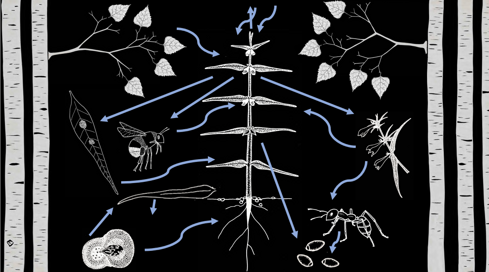
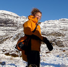

*Original artwork by SE Dalrymple 2018*

## Current positions

Senior Lecturer of Conservation Ecology, [Liverpool John Moores University](https://www.ljmu.ac.uk/about-us/staff-profiles/faculty-of-science/natural-sciences-and-psychology/sarah-dalrymple)

Editor, [British & Irish Botany](https://britishandirishbotany.org/index.php/bib)

Advisory Board member, [Applied Ecology Resources](https://www.britishecologicalsociety.org/publications/applied-ecology-resources/)

Associate Editor, [Ecological Solutions and Evidence](https://www.britishecologicalsociety.org/publications/applied-ecology-resources/)

Co-convenor, [Plant Translocation Network](https://sarahedalrymple.github.io/Plant-Translocation-Network/)

External Examiner, [MSc Biological Recording and Ecological Monitoring](https://www2.mmu.ac.uk/study/postgraduate/course/msc-biological-recording/), Manchester Metropolitan University

[Full CV available here](Dalrymple_CV_2021.pdf)

## Recent publications

Dalrymple, S. E., Winder, R., & Campbell, E. M. (2021). Exploring the potential for plant translocations to adapt to a warming world. Journal of Ecology, 109, 2264– 2270. [https://doi.org/10.1111/1365-2745.13715](https://doi.org/10.1111/1365-2745.13715)

Bellis, J., Longden, M., Styles, J., & Dalrymple, S.E. (2021). Using macroecological species distribution models to estimate changes in the suitability of sites for threatened species reintroduction. Ecological Solutions and Evidence, 2(1), 1–12. [https://doi.org/10.1002/2688-8319.12050](https://doi.org/10.1111/1365-2745.13715)

Nason, S. E., Lloyd, N., Kelly, C. D., Brichieri-Colombi, T., Dalrymple, S. E., & Moehrenschlager, A. (2021). Maximizing the effectiveness of qualitative systematic reviews: A case study on terrestrial arthropod conservation translocations. Biological Conservation, 254, 108948. doi.org/10.1016/j.biocon.2020.108948

Downey, H., Amano, T., Cadotte, M., Cook, C. N., Cooke, S. J.,Dalrymple, S.E., … Sutherland, W. J. (2021). Training future generations to deliver evidence‐based conservation and ecosystem management. Ecological Solutions and Evidence, 2(1), 1–11. [doi.org/10.1002/2688-8319.12032.](doi.org/10.1002/2688-8319.12032) Contribution: developed training materials now available online forming part of the training provision described in the paper.

Jaganathan, G. K., Dalrymple, S. E., & Pritchard, H. W. (2020). Seed Survival at Low Temperatures: A Potential Selecting Factor Influencing Community Level Changes in High Altitudes under Climate Change. Critical Reviews in Plant Sciences, 0(0), 1–25. [doi.org/10.1080/07352689.2020.1848277](doi.org/10.1080/07352689.2020.1848277)

Bellis, J.M., Bourke, D.O., Maschinski, J., Heineman, K. & Dalrymple, S.E. Climate suitability as a predictor of conservation translocation failure. Conservation Biology, [doi:10.1111/cobi.13518.](doi:10.1111/cobi.13518)

Dalrymple, S.E., Orsenigo, S., Godefroid S. & Abeli T. (2020). Frankenstein’s work or everyday conservation? How reintroductions are informing the de-extinction debate. Journal of Nature Conservation, 56, 125870, [doi.org/10.1016/j.jnc.2020.125870.](doi.org/10.1016/j.jnc.2020.125870)

Stringer, S.D., Hill, R.A., Swanepoel L., Dalrymple, S.E., Linden, B. & Koyama, N.F. (2020). Interpreting the role of frugivores in seed germination potential depends on study design: A case study from Soutpansberg Mountain, South Africa. Acta Oecologia, 106, 103584, [doi.org/10.1016/j.actao.2020.103584.](doi.org/10.1016/j.actao.2020.103584)

Abeli T, Dalrymple S.E., Godefroid S, Mondoni A, Müller J V., Rossi G, Orsenigo S. (2020). Ex situ collections and their potential for the restoration of extinct plants. Conservation Biology. [doi:10.1111/cobi.13391.](doi:10.1111/cobi.13391)

Dalrymple, S.E., Hopkins, J., Carter, S. & Slingsby, D.S. (2019) Nutrient additions three decades on: potential interactions of nutrients and climate in the recovery of a high latitude serpentine system. Plant Biosystems. [doi: 10.1080/11263504.2019.1701578](https://www.tandfonline.com/doi/abs/10.1080/11263504.2019.1701578)

Jaganathan GK, Dalrymple SE. (2019). Internal Seed Structure of Alpine Plants and Extreme Cold Exposure. *Data*. 4(3):107. [doi:10.3390/data4030107](https://www.mdpi.com/2306-5729/4/3/107)

Abeli T, Dalrymple S, Godefroid S, Mondoni A, Müller J V., Rossi G, Orsenigo S. (2019). Ex situ collections and their potential for the restoration of extinct plants. *Conservation Biology*. [doi:10.1111/cobi.13391](https://onlinelibrary.wiley.com/doi/abs/10.1111/cobi.13391)

Jaganathan GK, Bönisch G, Kattge J, Dalrymple SE. (2019). Physically, physiologically and conceptually hidden: Improving the description and communication of seed persistence. *Flora*. [doi:10.1016/j.flora.2019.05.012](https://doi.org/10.1016/j.flora.2019.05.012)

Bellis, J.M., Williams, C., Bourke, D.O. & Dalrymple, S.E. (2019). Identifying factors associated with the success and failure of terrestrial insect translocations.  *Biological Conservation* 236:29-36. [https://doi.org/10.1016/j.biocon.2019.05.008](https://www.sciencedirect.com/science/article/abs/pii/S0006320719302423)

Dalrymple, S.E. & Abeli, T. (2019). Ex situ seed banks and the IUCN Red List. *Nature Plants*. 5:122–123. [doi:10.1038/s41477-019-0366-3](https://www.nature.com/articles/s41477-019-0366-3)

## Github repositories

[Seeds_and_cold](https://sarahedalrymple.github.io/seeds_and_cold/): R script to enable the automated download and extraction of the coldest locations that alpine plants are known to occur.

[Ecological-replacement](https://sarahedalrymple.github.io/Ecological-replacement/): A set of analyses to explore niche overlap and ecological redundancy.

[All-purpose-biomod](https://sarahedalrymple.github.io/All-purpose-biomod/): R script to help new users of biomod to do the necessary data downloads and prep.

## Contact

Email: [s.e.dalrymple@ljmu.ac.uk](s.e.dalrymple@ljmu.ac.uk)

Twitter: [@SarahEDalrymple](https://twitter.com/SarahEDalrymple)
